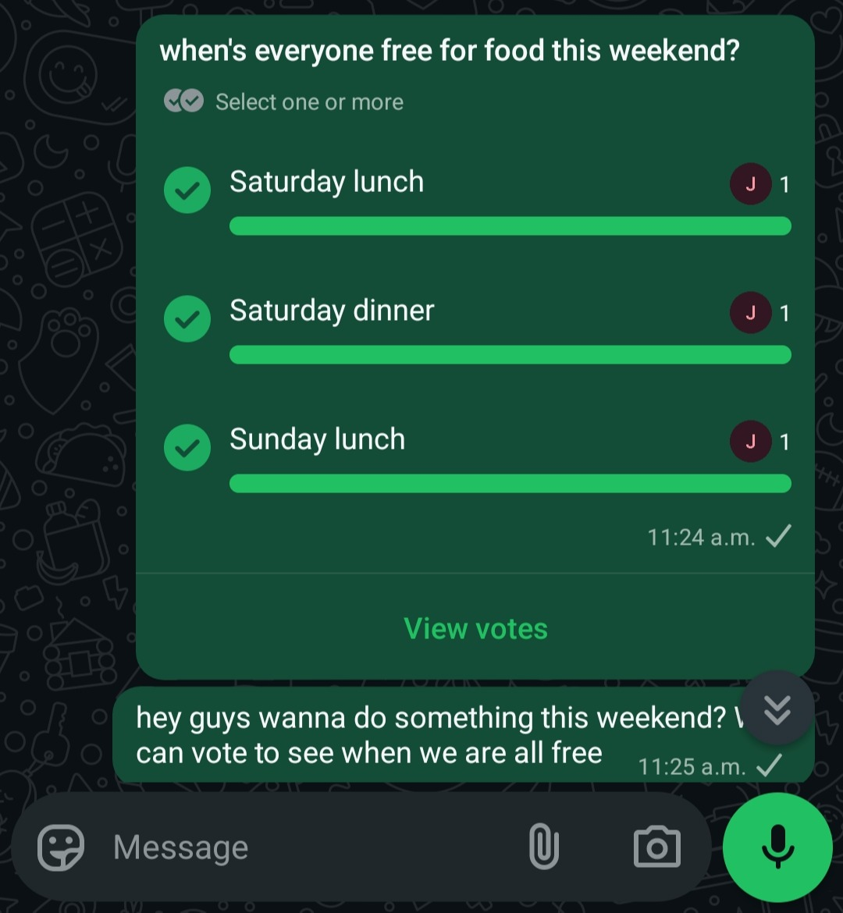
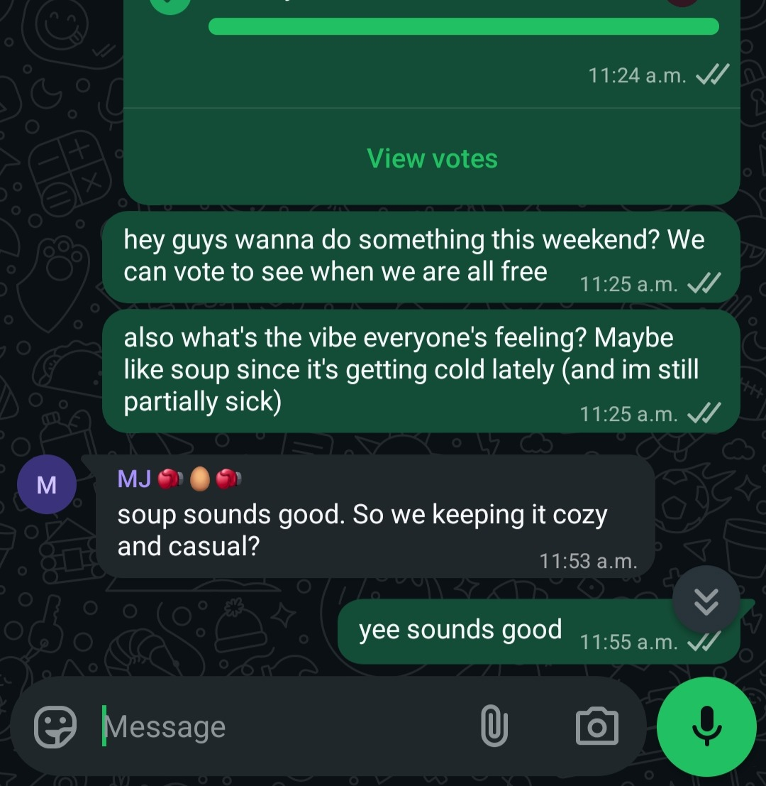
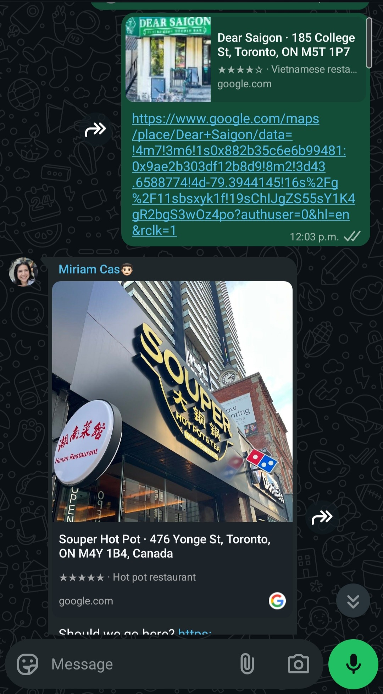
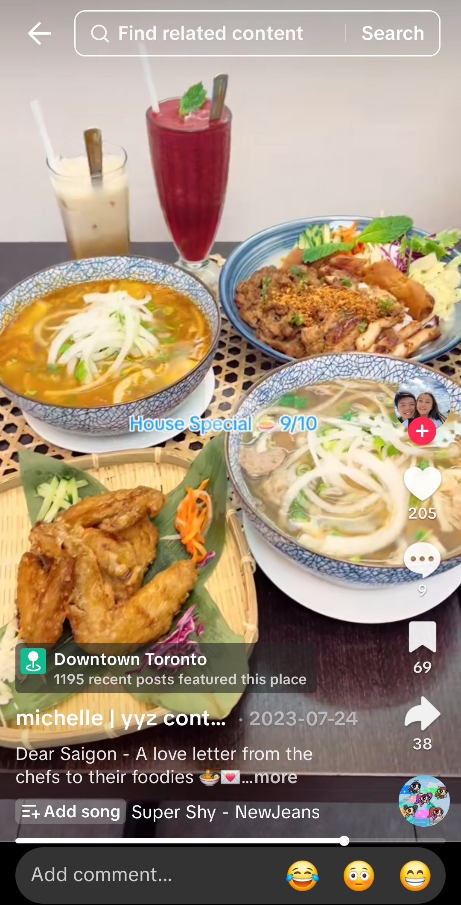
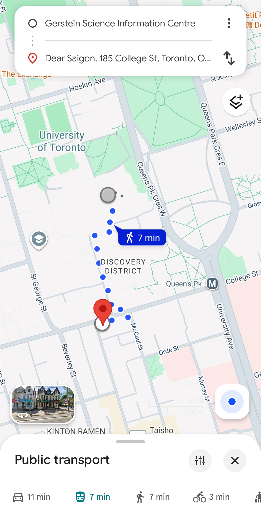
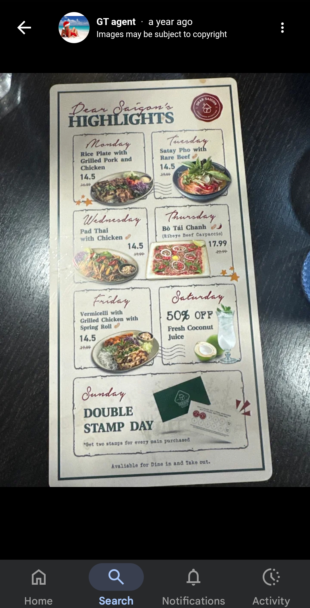
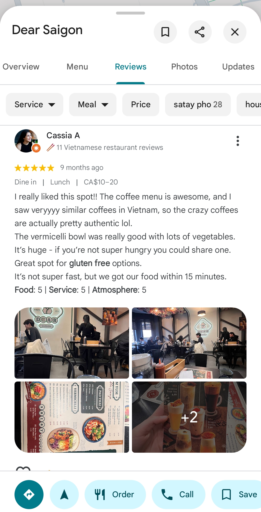
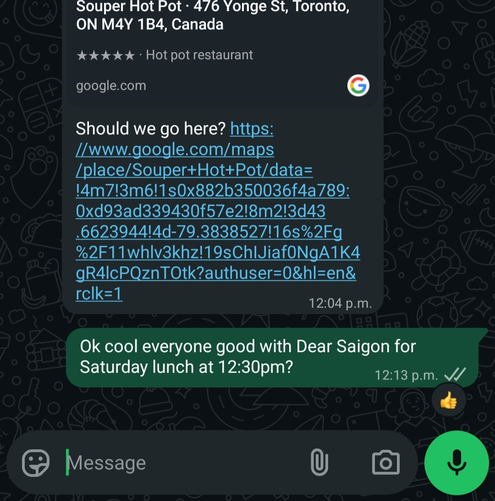
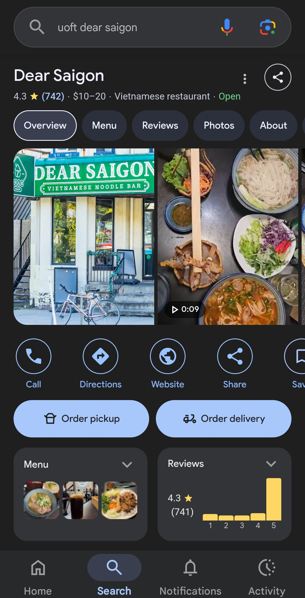
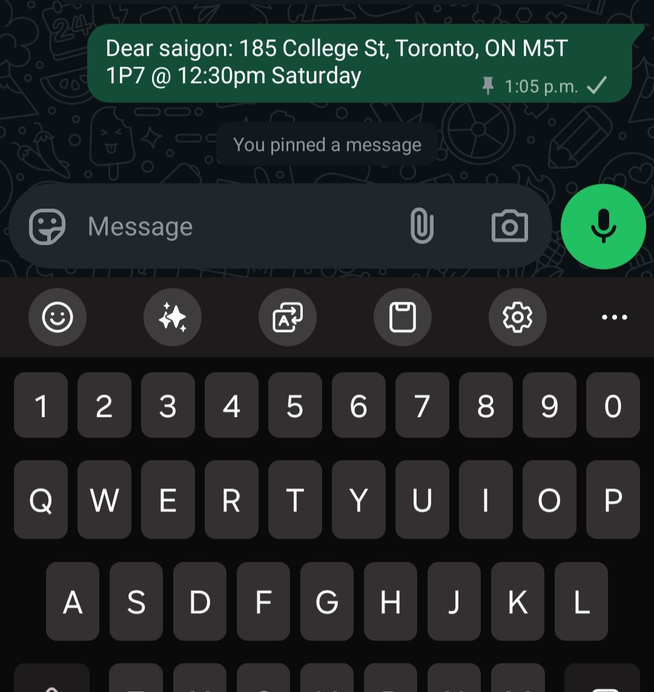

# A7 CUJ Runthrough + Demo of Google Maps & Reviews
In this document, we discuss our step-by-step experience using Google Maps & Reviews. We include recommendations for improvement, discussions regarding the most difficult steps, as well as areas of improvement.

### Submission Date: 11/06/2025

## Team Information
### Team Name – Palate   
Franco Miguel Valencia – 1009486771   
Jisung Shin – 1004192170

## TL;DR
Google Maps and Google Reviews are accessible and intuitive tools for restaurant discovery, offering extensive information like reviews, photos, and business details. However, they **lack personalization** and thus require **frequent switching** between apps and websites to compare options and share information. This fragmentation matters because it increases decision fatigue. Our product should centralize discovery and decision-making to reduce context switching and improve group coordination.
 

## Our User Goal
***“As a university student who loves exploring new spots with friends, I want to find restaurants that match our group’s vibe, so that I can spend less time deciding and more time enjoying the moment.”***

## Summary of Findings

### User Persona
The Social Explorer represents a segment of Gen-Z users who are university or college students, typically aged between 18 and 24, living in urban areas like Toronto. They are highly social, goes out with friends minimum 3 times a week, and sees dining as an experience rather than "just eating." Their goal is not just to find food, but to find a vibe – a place that matches their group’s energy.
This persona is digitally fluent, spends significant time on social media platforms like TikTok and Instagram, and uses Google Maps when locating where to eat. Their expertise level with existing restaurant discovery platforms is high in terms of usage frequency, but limited in satisfaction. They’ve tried mainstream tools like Yelp and OpenTable, as well as social media discovery (e.g., searching “Toronto spots” on TikTok). However, their frustration stems from having to cross-reference multiple platforms, such as Google Reviews for menus, Yelp for reviews, and Instagram for vibes.
They are not loyal to any single discovery app and often rely on word-of-mouth or influencers whose tastes align with theirs. They crave personalized recommendations that “get them,” not just what’s popular.

### Tools Used
- Group Chat (WhatsApp) – for coordinating with friends and sharing links.
- Google Maps & Google Reviews – for nearby restaurant locations, reviews, and hours.
- TikTok and Instagram – for discovering trending restaurants and visuals.
- Google Search – gateway to Google Maps and Places results.

### Reflection and Areas of Improvement

Using Google Maps and Reviews gave us valuable insight into how users currently navigate the restaurant discovery process, which is currently a mix of convenience and inefficiency. The biggest strength of the platform lies in the scope of its data: it covers nearly every establishment, offers real-time closure updates, and integrates seamlessly with navigation. The visuals (photos, street view, and busy-time graphs) make it easy to assess ambiance and logistics quickly.

That said, the user experience falters in areas where **human context and emotion** play a key role. Most Gen-Z users, especially our persona, "The Social Explorer," don’t just want to know what’s nearby — they want to know what fits their unique preferences. Google’s interface isn’t designed to capture that nuance. Its algorithm prioritizes high-traffic or well-rated spots rather than personalized matches. We discovered that we were **constantly toggling** between apps (e.g., TikTok for visuals, WhatsApp for coordination) to supplement what Google lacks in emotional and aesthetic curation.

This **constant context switching** becomes one of the most significant sources of friction. Each switch requires users to reorient, cross-check information, and it distracts the goal oriented mindset. Over time, this fragmentation leads to decision fatigue and frustration, which can result in a high churn rate: users either give up entirely or settle for the first option that feels “good enough.” This behavioral outcome undermines satisfaction because when the experience turns out underwhelming, users tend to blame the product, not themselves. In other words, the product inherits the disappointment created by an inefficient discovery process.

We also observed that decision-making within groups becomes tedious. Sharing a restaurant link via WhatsApp often triggers endless **back-and-forths** as each member opens Maps separately to review photos, menus, and reviews. There’s no integrated group decision support — no shared shortlists, voting tools, or vibe tags that help align preferences.

From this CUJ, we identified several actionable improvements for designing a future, vibe-driven discovery app:

### For Google Maps & Reviews (Product Improvements):
- Introduce contextual filtering options such as mood (“chill,” “romantic,” “aesthetic”) or ambiance (“quiet,” “lively,” “outdoor-friendly”).
- Improve semantic search to better interpret user intent rather than exact keywords.
- Enhance the review surfacing system to prioritize descriptive, high-quality reviews with sentiment scoring.
- Allow group collaboration features, such as shared shortlists or in-app polls, to streamline collective decision-making.

### For Future Users (Behavioral Recommendations):
- Combine Google Maps with social platforms (TikTok or Instagram) for better visual context before deciding
- Use keyword modifiers (e.g., “cozy café near UofT,” “quiet dinner restaurant Toronto”) to narrow results.
- Bookmark or create custom lists on Maps to track favorite places and avoid repetitive searching.
- When coordinating in groups, use a shared Google Map list rather than long chat threads to save time.

### Highlights and Lowlights

| **Category** | **Tasks** | **Description / What Happened** | **Severity / Difficulty** |
|--------------|------------|----------------------------------|----------------------------|
| **Group Coordination & Planning** | Steps 1–3 (Reach out, Set vibe, Idea dump) | Group chat coordination worked well for starting plans, but consensus-building was messy. Messages got buried quickly and comparing multiple links across chats was inefficient. | **Moderate** |
| **Discovery & Research** | Steps 4–6 (Scan trends, Check hours, Confirm location) | TikTok/Instagram provided inspiration, while Google Maps verified logistics. However, platform switches were very frequent and caused context loss, and some information (e.g., crowd level, parking) was inconsistent. | **Severe** |
| **Information Validation** | Steps 7–8 (Menu check, Dietary constraints) | Menus and dietary options were difficult to confirm. Links often led to outdated PDFs or incomplete data, and external websites had to be visited in order to find this information. Keyword searches for “vegan” or “halal” in reviews returned unreliable results. | **Severe** |
| **Decision-Making** | Steps 9 (Shortlist, Quick confirmation) | The group used emoji votes in WhatsApp to finalize choices. While simple, this method was prone to bias, duplicates, and missing input from late voters. | **Moderate** |
| **Booking & Confirmation** | Steps 10-11 (Reservation, Final) | Reservation redirections to third-party apps added friction, and final details got lost in chat noise. Reconfirmations were common because important info wasn’t easily accessible. | **Severe** |

### CUJ Overview Table
| **Phase**                  | **Steps** | **Estimated Time to Complete** | **Context Switches** |
| -------------------------- | --------- | ------------------------------ | -------------------- |
| **Group Coordination**     | 1–3       | ~15–20 min                     | 6                    |
| **Discovery & Research**   | 4–6       | ~25–30 min                     | 12                   | 
| **Information Validation** | 7–8       | ~20 min                        | 10                   | 
| **Decision-Making**        | 9         | ~10–15 min                     | 1                    |
| **Booking & Confirmation** | 10-11     | ~15–20 min                     | 4                    |

**Total Time**: ~85–105 minutes (1.5 hours)
**Total Context Switches**: ~29
**Overall Experience**: A smooth start with coordination and discovery, but high friction during validation and booking due to fragmented information and limited personalization. A lot of context switching leads to frustration.

### End-to-End User Journey Documentation

| **Step** | **Notes** | **Screenshot** |
|-----------|------------|----------------|
| **1. Reach out to the group** | Created a WhatsApp group thread and polled for availability among friends. |  |
| **2. Determine the occasion & vibe** | Agreed on “casual & cozy" as the mood for the outing. |  |
| **3. Initial idea dump (share first options)** | Friends pasted Google Maps links and TikTok/Instagram posts into the chat. |  |
| **4. Scan trending options and send to group chat** | Browsed TikTok and Instagram for “Pho places near UofT" and saved 3 reels as references, switching to the group chat to send links along with a short description of each. |  |
| **5. Check real details (hours, busy times)** | Based on the links sent in the group chat, clicked through Google Search results to Maps listings for reviews and hours. |  |
| **6. Confirm location convenience** | Reviewed each restaurant's distance from campus and checked transit/parking availability on Google Maps. |  |
| **7. Menu and price sanity check** | Checked menus through Google Maps and restaurant websites; noticed menu info from a year ago that could potentially be outdated. Had to visit an external restaurant website in order to validate this information. |  |
| **8. Dietary constraints pass** | Used Google Search and Maps to verify gluten free options; relied on keywords in reviews. |  |
| **9. Quick confirmation (vote)** | Used emoji reactions in WhatsApp to vote and finalize the restaurant. |  |
| **10. Reservation check** | Looked for the “Reserve” button in Google Maps, but this button was not found. Instead, used "phone." Learned that the restaurant does not take reservations. |  |
| **11. Final confirmation** | Pinned the chosen restaurant’s address and meeting time in the WhatsApp chat. |  |
